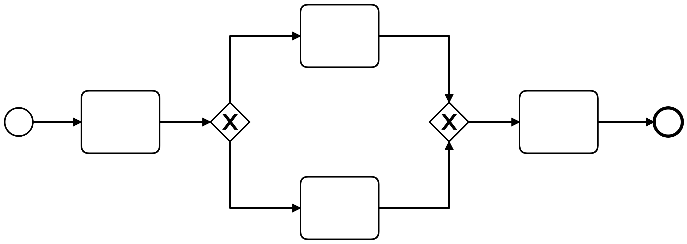

# [Name des Prozesses]

## Kurzbeschreibung

## Technischer Name

Der eindeutige Bezeichner des Prozesses lautet wie folgt:

`TravelInsuranceProcess`

## Organisatorischer Kontext

### Prozessziele
- Die UX des Kunden soll verbessert werden, indem der Antrag schneller bearbeitet wird.
- Den Mitarbeitern sollen repetitive Aufgaben abgenommen werden, damit sie sich auf das Wesentliche fokussieren können.
- Es soll eine bessere Überwachbarkeit garantiert werden, um schneller auf Fehler und Engpässe reagieren zu können. 
- Es sollen Kosten eingespart werden, indem weniger Mitarbeiter benötigt werden. 
- Es soll schneller auf Veränderungen am Markt, Kundenwünsche und gesetzliche Vorgaben reagiert werden. 

### Stakeholder

| Personengruppe      | Details                                                                                                                                                                                                                                                                                                    |
| ------------------- |------------------------------------------------------------------------------------------------------------------------------------------------------------------------------------------------------------------------------------------------------------------------------------------------------------|
| Prozesseigner:innen | Das Unternehmen ist der Stakeholder. Es misst den Erfolg des Prozesses, indem es die alten Metriken vor der Einführung des Prozesses mit den neuen Metriken vergleicht. Zudem soll gemessen werden, ob der Prozess mehr Kunden als zuvor generiert und den manuellen Aufwand der Mitarbeiter reduziert. |
| Prozessbeteiligte   | Prozessbeteiligte sind zum einen der Kunde, der das Formular mit seinen Daten ausfüllt und zum anderen die Mitarbeiter der Sachbearbeitung, die bei Inkonsistenzen zwischen Daten im System und der Benutzereingabe intervenieren.                                                                         |
| Kund:innen          | Der Kunde ist der Versicherungsnehmer. Der Prozess bietet dem Kunden eine schnellere und bequemere Abwicklung seines Anliegens als Mehrwert.                                                                                                                                                               |

### Anwendungssysteme

| System                                | Details                                                                                                                                                  |
|---------------------------------------|----------------------------------------------------------------------------------------------------------------------------------------------------------|
| Reisewarnungen OpenData Schnittstelle | Es wird für als Quelle für die Validierung des Reiseziels verwendet.                                                                                     |
| Api Ninjas IBAN API                   | Es wird als Quelle für die Validierung der IBAN verwendet.                                                                                               |
| Travel Insurance API                  | Es wird als Quelle für die Suche eines Kunden, Anlegen eines Kunden, Speicherung eines Vertrags und Drucken und Senden der Vertragsunterlagen verwendet. |

## Prozessbeginn

### Start / Auslöser

| Startbedingung  | Details                                         |
|-----------------|-------------------------------------------------|
| Eingabeformular | Der Kunde füllt das Formular aus und sendet es. |
|                 |                                                 |
|                 |                                                 |

### Input

| Eingabe                     | Details                                                                                                                                                                       |
|-----------------------------|-------------------------------------------------------------------------------------------------------------------------------------------------------------------------------|
| Eingabefelder des Forumlars | Vorname, Nachname, Geburtsdatum, Wohnsitz, IBAN, Reiseziel, Reisestart, Reiseende, Zusatzversicherung, Kosten der Reise, weitere versicherte Personen, Kundenummer (optional) |
| Authentifizierung           | API-Schlüssel (API Ninjas), Nutzername mit Passwort (Travel Insurance API), API-Schlüssel (SendGrid)                                                                          |
|                             |                                                                                                                                                                               |

## Prozessschritte

### Prozessschritt 1

### Prozessschritt 2

## Prozessende

### Ende

| Endbedingung                                           | Details                                                                                                                                                                                                                                                                                                                                                           |
|--------------------------------------------------------|-------------------------------------------------------------------------------------------------------------------------------------------------------------------------------------------------------------------------------------------------------------------------------------------------------------------------------------------------------------------|
| Gutfall                                                | Das System hat den Vertrag des Kunden gespeichert. Das System hat den Kunden eingetragen, sofern er nicht schon vorher ein Kunde war. Bei Bedarf wurde die Adresse durch die Sachbearbeitung korrigiert. Der Kunde wird über den erfolgreichen Abschluss der Reiseversicherung per E-Mail informiert. Der Vertragsunterlagen sind per Post auf dem Weg zum Kunden. |
| Fehlerfall: Falsche Reisedaten                         | Das System bricht den Prozess ab, ohne den Kunden zu benachrichtigen.                                                                                                                                                                                                                                                                                             |
| Fehlerfall: Kein passender Tarif für persönliche Daten | Das System informiert den Nutzer per E-Mail warum es keine verfügbare Police für Ihn gibt.                                                                                                                                                                                                                                                                        |

### Ergebnis / Output

| Geschäftsobjekt                 | Zielsystem     | Verantwortlich       |
|---------------------------------|----------------|----------------------|
| ausgedruckte Vertragsunterlagen | Post           | Output-Management    |
| Bestätigungsmail                | E-Mail         | SendGrid             |
| Vertrag                         | Vertragssystem | Travel Insurance API |

## Prozesskontext

Folgende Variablen werden während der Ausführung im Prozesskontext abgelegt:

| Variablenname   | Typ  | Datentyp | Details |
|-----------------| ---- | -------- | ------- |
| travelInsurance |      |          |         |
|                 |      |          |         |
|                 |      |          |         |
