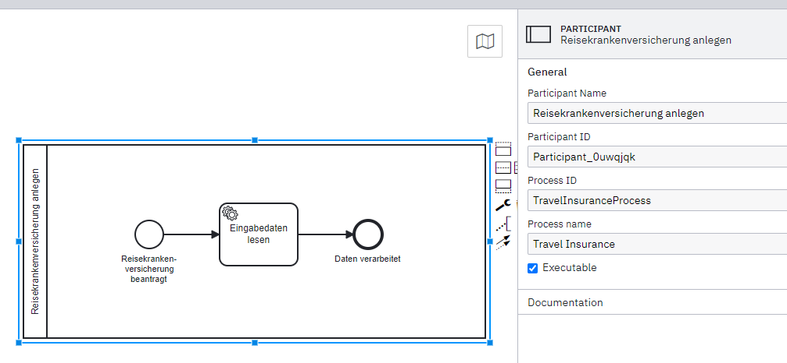
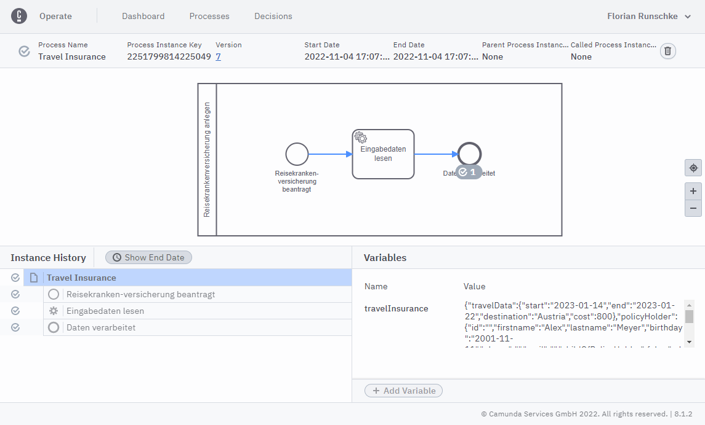

# Beispiel-Prozessanwendung Camunda 8  

### Hinweis  
> Dieses Projekt ist eine Starthilfe zur Umsetzung der Fallstudie "Reisekrankenversicherung". Es enthält  
> nur ein unvollständiges Prozessmodell und etwas Beispielcode zur Veranschaulichung. Die vollständige  
> Umsetzung der eigentlichen Fachlichkeit ist Teil der Fallstudie und nicht in diesem Projekt zu finden.  

### :star: Features
* Automatisches Deployment von Prozessmodellen im Cluster von Camunda 8
* Simples Frontend auf Basis von [Thymeleaf](https://www.thymeleaf.org) zur Dateneingabe
* Start von Prozessinstanzen über das Frontend, bzw. die Prozessschnittstelle
* Zeebe-Job-Worker zur Verarbeitung eines Service-Tasks, inkl. Auslesen von Daten

### Voraussetzungen
* Java 17
* Zugangsdaten Camunda 8 (SaaS)

### :paperclip: How-To
#### :key: Zugangsdaten erhalten
* Einloggen https://console.cloud.camunda.io
* Cluster → API auswählen
* `Create new Client`
* Scope `Zeebe` → `Create`
* Die Zugangsdaten sind die folgenden:
  * Client Secret: Wie angezeigt
  * Client-Id: Wie angezeigt
  * Cluster-Id: Der erste Teil der Cluster-Url (`Uuid`)
  * Cloud-Region: Der zweite Teil der Cluster-Url (z.B. `dsm-1`)
* Zugangsdaten als Umgebungsvariablen setzen oder in [application.properties](src/main/resources/application.properties) einfügen
  * Umgebungsvariablen
    * ```
      cluster-id:    ${ZB_CLUSTER}  
      client-id:     ${ZB_CLIENT}  
      client-secret: ${ZB_SECRET}  
      region:        ${ZB_REGION}
      ```
  
#### :rocket: Anwendung starten
* Projekt in geeignete IDE importieren
* Maven-Abhängigkeiten herunterladen
* Umgebungsvariablen für Zeebe setzen (vgl. Zugangsdaten)
* Anwendung starten
* `http://localhost:8080` aufrufen

### :checkered_flag: Prozessinstanz starten
* Formular ausfüllen und absenden, oder
* `Post`-Request auf den Rest-Endpunkt `/api/travel-insurance` (vgl. [InsuranceRestController](src/main/java/de/viadee/bpm/camunda/travelinsuranceprocessapp/processinterface/InsuranceRestController.java))
* Anschließend wird jeweils über den [TravelInsuranceService](src/main/java/de/viadee/bpm/camunda/travelinsuranceprocessapp/service/TravelInsuranceService.java)
eine entsprechende Prozessinstanz gestartet: 
```
zeebeClient.newCreateInstanceCommand()
           .bpmnProcessId("TravelInsuranceProcess") // <- Process Id (vgl. Processmodell)
           .latestVersion().send().join();
```



* Die Prozessinstanz ist in Camunda Operate zu sehen, ggf. ist sie bereits beendet:



* Im Anwendungslog stehen die Log-Ausgaben des [JobWorker](src/main/java/de/viadee/bpm/camunda/travelinsuranceprocessapp/worker/TravelInsuranceReadInputData.java): 
```
... d.v.b.c.t.w.TravelInsuranceReadInputData : Start 'read-input-data'... 
... d.v.b.c.t.w.TravelInsuranceReadInputData : input-data [type=String]: {"travelInsurance":{"travelData":{"start":"2023-01-14","end":"2023-01-22","destination":"Austria","cost":800},"policyHolder":{"id":"","firstname":"Alex","lastname":"Meyer","birthday":"2001-11-11","iban":"","mail":"","childOfPolicyHolder":false,"address":{"street":"","number":"","postCode":"","city":"","country":""},"insured":false},"insuredPartners":[],"baggageInsurance":true,"travelCancellation":true}}
... d.v.b.c.t.w.TravelInsuranceReadInputData : input-data [type=TravelInsuranceRequest]: [travelInsurance=[baggageInsurance=true,insuredPartners=[],policyHolder=[address=[city=,country=,number=,postCode=,street=],birthday=2001-11-11,childOfPolicyHolder=false,firstname=Alex,id=,isInsured=false,lastname=Meyer,mail=,iban=],travelCancellation=true,travelData=[cost=800,destination=Austria,end=2023-01-22,start=2023-01-14]]]
```

### :point_up: Hinweis
> Dieses Projekt dient nur zu Demo-Zwecken und wird nicht aktiv gepflegt,  
> d.h. Abhängigkeiten sind möglicherweise veraltet und es sind keine Sicherheitsmechanismen enthalten
