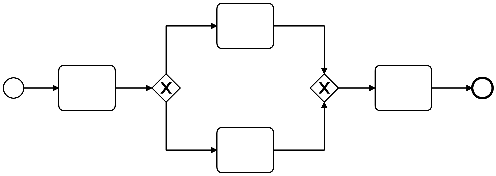

# [Name des Prozesses]

## Kurzbeschreibung

## Technischer Name

Der eindeutige Bezeichner des Prozesses lautet wie folgt:

`TravelInsuranceProcess`

## Organisatorischer Kontext

### Prozessziele

- Die UX des Kunden soll verbessert werden, indem der Antrag schneller bearbeitet wird.
- Den Mitarbeitern sollen repetitive Aufgaben abgenommen werden, damit sie sich auf das Wesentliche fokussieren können.
- Es soll eine bessere Überwachbarkeit garantiert werden, um schneller auf Fehler und Engpässe reagieren zu können. 
- Es sollen Kosten eingespart werden, indem weniger Mitarbeiter benötigt werden. 
- Es soll schneller auf Veränderungen am Markt, Kundenwünsche und gesetzliche Vorgaben reagiert werden. 

### Stakeholder

| Personengruppe     | Details                                                                                                                                                                           |
|--------------------|-----------------------------------------------------------------------------------------------------------------------------------------------------------------------------------|
| Projektmanager     | Projektmanager überwacht und verwaltet den gesamten Entwicklungsprozess und stellt sicher, dass die Ziele innerhalb der definierten Grenzen erreicht werden                       |
| Technisches Team   | Technisches Team ist für die Entwicklung des Prozesses und die Fehlerbehandlung während des Prozessverlaufs verantwortlich und gewährleistet eine robuste und skalierbare Lösung. |
| API-Anbieter       | API-Anbieter bieten die APIs für wichtige Features des Prozesses an.                                                                                                              |
| Kund:innen         | Kund:innen sind die Antragsteller. Nachdem Prozess erfolgreich abgeschlossen war, sind sie Versicherungsnehmer und in der gesammten Reise von den Versicherungsunternehmen gesichert.|

### Anwendungssysteme

| System                                | Details                                                                                                                                                  |
|---------------------------------------|----------------------------------------------------------------------------------------------------------------------------------------------------------|
| Reisewarnungen OpenData Schnittstelle | Es wird für als Quelle für die Validierung des Reiseziels verwendet.                                                                                     |
| Api Ninjas IBAN API                   | Es wird als Quelle für die Validierung der IBAN verwendet.                                                                                               |
| Travel Insurance API                  | Es wird als Quelle für die Suche eines Kunden, Anlegen eines Kunden, Speicherung eines Vertrags und Drucken und Senden der Vertragsunterlagen verwendet. |

## Prozessbeginn

### Start / Auslöser

| Startbedingung  | Details                                                            |
|-----------------|--------------------------------------------------------------------|
| Eingabeformular | Der Prozess wird gestartet, sobald ein Kunder das Formular sendet. |
|                 |                                                                    |
|                 |                                                                    |

### Input

| Eingabe                     | Details                                                                                                                                                                       |
|-----------------------------|-------------------------------------------------------------------------------------------------------------------------------------------------------------------------------|
| Eingabefelder des Formulars | Vorname, Nachname, Geburtsdatum, Wohnsitz, IBAN, Reiseziel, Reisestart, Reiseende, Zusatzversicherung, Kosten der Reise, weitere versicherte Personen, Kundenummer (optional) |
| Authentifizierung           | API-Schlüssel (API Ninjas), Nutzername mit Passwort (Travel Insurance API), API-Schlüssel (SendGrid)                                                                          |
|                             |                                                                                                                                                                               |

## Prozessschritte

### Prozessschritt 1
Erst nachdem die in der Formular eingegebenen Daten im System erhalten waren, werden diese Daten durch den Service Task “Eingabedaten lesen” als Json gelesen. Mit der Task-type “read-input-data” ruft der Task ein JobWorker “TravelInsuranceReadInputData” auf und die erhaltenen Daten werden als Ausgabevariable “travelInsurance”, die alle Informationen von der Reise, dem Versicherungsnehmer und den versicherten Personen beinhalten, erzielt.

### Prozessschritt 2
Dieser Schritt besteht aus 2 parallelen Subprozesse für das Prüfen der Reisedaten und der persönlichen Daten:

- “Check travel data” erhält eine Eingabevariable “travelData” und ruft check_travel _data_process auf, indem werden 4 folgenden Aufgaben werden gleichzeitig durchgeführt:
  - 3 Script Tasks “Check travel cost”, “Check travel start with end” und “Check travel start” geben aufeinanderfolgenden Boolesche Variable travelCostIsPositive, travelStartBeforeEnd und travelStartsInFuture aus.
  - Daneben ist eine Sequenz von einem Rest Outbound Connector “Get travel warnings” mithilfe der öffentlichen Reisewarnungen OpenData Schnittstelle, 2 Script Tasks “Filter travel warnings” und “Check travel destination”. Schließlich gibt die Boolesche Variable travelDestinationIsSafe aus.
    
    Dieser Subprozess ergibt sich die Ausgabevariable travelDataIsValid, die die in der Subprozess erzeugten Ausgaben vereinigt.

- “Check personal data” erhält 2 Eingabevariablen personalData und insuredPartnersCount und ruft “Check personal data process” auf, der die folgenden Punkten beinhaltet:
    - “Check IBAN” ist mithilfe von Api Ninjas IBAN API ausgeführt. Bei einer invaliden IBAN wird die VN durch Sendgrid Outbound Connector “Inform customer about invalid IBAN” darüber informiert.
    - “Check place of residence” ruft eine DMN Decision auf.
    - Zum Prüfen ob die VN mehr als 18 Jahre alt ist sowie ob die Anzahl der versicherten Personen weniger als 7 ist, werden jeweils 2 Script Tasks verwendet.
    - Danach kommt ein Sendgrid Outbound Connector “Inform customer about reason of rejection”, falls die persönliche Daten die angegebenen Kriterien nicht erfüllen.

  Ausgabevariable personalDataIsValid dieses Subprozesses ist  eine Vereinigung der in der Subprozess erzeugten Booleschen Ausgaben.

### Prozessschritt 3
Dann kommt ein Gateway “Data is correct” vor. Wenn eine der 2 Variablen travelDataIsValid und personalDataIsValid den Wert false liefert, wird der Antrag sofort abgesagt werden und der gesammte Prozess wird sofort abschließen. Ansonsten wird er zu den Zustand “Data correct” landen und weiter laufen.

### Prozessschritt 4
Hier werden 2 Tasks parallel ausgeführt:
Script Task “Calculate travel duration” mit 2 Eingabevariablen travelStart und travelEnd und
Business Rule Task “Classify travel destination country” ruft classify_travel_destination.dmn mit Ausgabename travelDestinationClass auf.

### Prozessschritt 5
Customer existence check

### Prozessschritt 6
Als Weiteres ruft “Determine deductible” ein DMN auf, um den Selbstbehalt zu klassifizieren. Die Ausgabe deductible hängt hier von 3 vorher erzeugten Variablen: customerExist, travelDurationInDays und travelDestination.

### Prozessschritt 7
Als 7. Schritt stehen alle benötige Informationen für dem Speichern des Vertrag ins System zur Verfügung. Der Rest Outbound Connector “Save contract” ruft eine vorhandene API aus Travel Insurance API auf, dabei muss folgenden Daten eingegeben werden:
- Authentication: Type Basic mit Username und Password aus Unterlagen.
- HTTP Endpoint: mit Method und URL aus Travel Insurance API
- Connection timeout: 20s
- Payloads: Request body

Der Task gibt anschließend Variable response aus, was insuranceId enthält.

### Prozessschritt 8
Send confirmation email

### Prozessschritt 9
Schließlich werden die Vertragsunterlagen per Post an die Kundin schicken, indem Rest Outbound Connector “Print and send insurance policy documents” mit Travel Insurance API verwendet wird. Er enthält fogende Informationen:
- Authentication: Type Basic mit Username und Password aus Unterlagen.
- HTTP Endpoint: mit Method und URL aus Travel Insurance API
- Connection timeout: 20s

## Prozessende

### Ende

| Endbedingung                                           | Details                                                                                                                                                                                                                                                                                                                                                           |
|--------------------------------------------------------|-------------------------------------------------------------------------------------------------------------------------------------------------------------------------------------------------------------------------------------------------------------------------------------------------------------------------------------------------------------------|
| Gutfall                                                | Das System hat den Vertrag des Kunden gespeichert. Das System hat den Kunden eingetragen, sofern er nicht schon vorher ein Kunde war. Bei Bedarf wurde die Adresse durch die Sachbearbeitung korrigiert. Der Kunde wird über den erfolgreichen Abschluss der Reiseversicherung per E-Mail informiert. Der Vertragsunterlagen sind per Post auf dem Weg zum Kunden. |
| Fehlerfall: Falsche Reisedaten                         | Das System bricht den Prozess ab, ohne den Kunden zu benachrichtigen.                                                                                                                                                                                                                                                                                             |
| Fehlerfall: Kein passender Tarif für persönliche Daten | Das System informiert den Nutzer per E-Mail warum es keine verfügbare Police für Ihn gibt.                                                                                                                                                                                                                                                                        |

### Ergebnis / Output

| Geschäftsobjekt                 | Zielsystem     | Verantwortlich       |
|---------------------------------|----------------|----------------------|
| ausgedruckte Vertragsunterlagen | Post           | Output-Management    |
| Bestätigungsmail                | E-Mail         | SendGrid             |
| Vertrag                         | Vertragssystem | Travel Insurance API |

## Prozesskontext

Folgende Variablen werden während der Ausführung im Prozesskontext abgelegt:

| Variablenname   | Typ  | Datentyp | Details |
|-----------------| ---- | -------- | ------- |
| travelInsurance |      |          |         |
|                 |      |          |         |
|                 |      |          |         |
